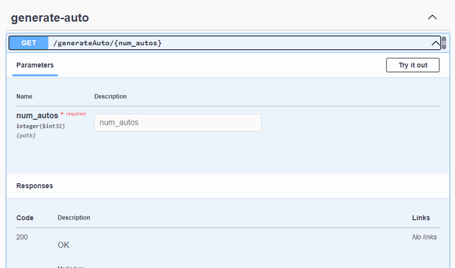
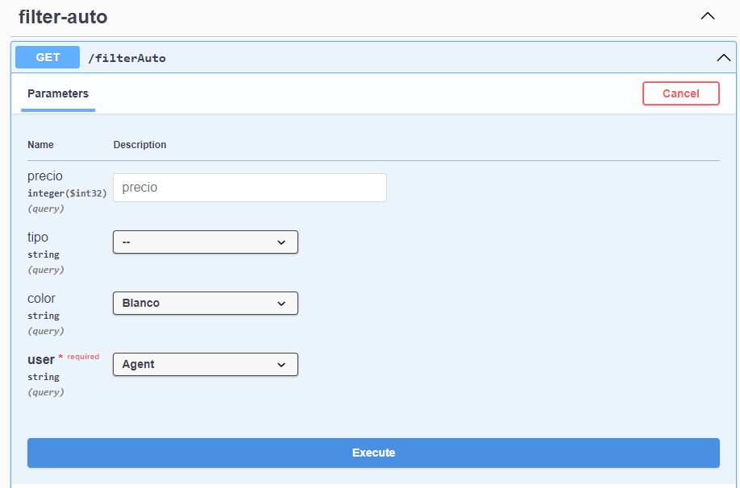
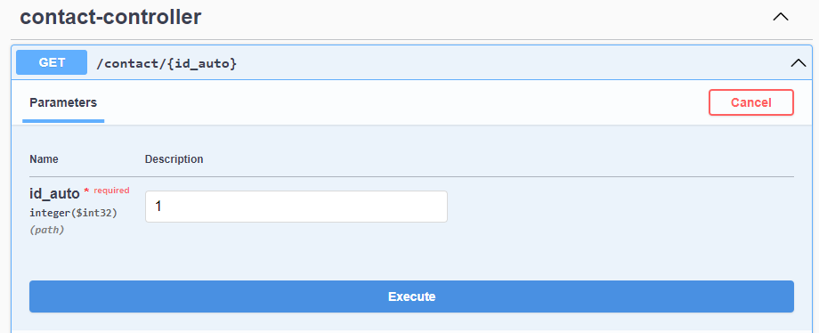

# Automobile Generator

## Description
This project is an API that generates a 'n' automobiles. Being 'n' a number that the user can choose. This data also can be filtered by type, color and price.

This API is developed in Java 17 and Spring Boot 3.1.4. It also uses MySql as database.

## How to run

First of all, these are the requirements to run this project:
- Java 17
- Make sure you have MySql installed and running locally

### 1. Clone the repository
Open your terminal and run the following command:
`git clone https://github.com/Maruxi01/Tarea1-PruebasSoftware.git`
Then, go to the project folder:
`cd Tarea1-PruebasSoftware`

### 2. Create the database
The database is called `autos_db`, you can create it in your db manager of choice. The project will create the tables automatically.
- Username: admin
- Password: admin

You can create the user and grant the privileges with this command:
```
CREATE USER 'admin'@'localhost' IDENTIFIED BY 'admin';
GRANT ALL PRIVILEGES ON autos_db.* TO 'admin'@'localhost';
FLUSH PRIVILEGES;
```
You can change the db_name, port, the username and password, in the `application.properties` file.
### 3. Run the project
To run the project, you can use the following command:
`./mvnw spring-boot:run`
or in Windows:
`mvnw.cmd spring-boot:run`
You can also run the project from your IDE of choice.
### 4. Use the API
This project uses Swagger to document the API. To access it, go to the following URL:
`http://localhost:8080/swagger-ui.html`
There you can see all the endpoints and test them.
## Example of use
There is three enpoints in this API:

### 1. Generate automobiles
This endpoint generates a determined number of automobiles with random features. The user can choose the number of automobiles to generate with variable
`num_autos`.
Like is shown in the following image:


### 2. Filter automobiles
This endpoint filters the automobiles by user, type, color and price. The user can choose the filters that he wants to apply. The filters are:
- User: The user that is filtering the automobiles. The user can be `agent` or `user`. If is an agent, the popularity of the automobiles increases by 1.
- Precio: The price of the automobiles. 
- Tipo: The type of the automobiles. The type can be `sedan`, `camioneta`, `suv`
- Color: The color of the automobiles. The color can be `Blanco(White)`,`Rojo(Red)`,`Amarillo(Yellow)`,`Gris(Grey)`, `Naranjo(Orange)`



### 3. Contact the agency
This endpoint allows the user to contact the agency. This will increase the popularity of the automobiles by 1.
- id: The id of the automobile that the user wants to contact the agency.



## Author
Mara Villagrán
m.villagran02@ufromail.cl
